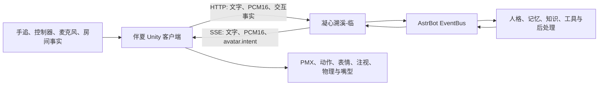

# 伴夏 (Banxia)

“伴夏”是一个面向 Meta Quest 3 的 Unity 混合现实虚拟陪伴项目，让虚拟角色自然地存在于现实房间中。当前前端负责模型显示、基础交互、彩色 Passthrough、Quest 手追/手柄输入、VMD 动作和 AstrBot HTTP/SSE 对话桥接。

仓库名使用 `banxia`。它不绑定 Quest、MMD 或 AstrBot 品牌，便于未来扩展到其他 XR 设备、模型格式、长期记忆和关系系统。

本仓库不会提交用户提供的 PMX/GLB、贴图或第三方 VMD 动作。它们继续保留在开发机本地；新克隆在没有模型素材时使用内置回退角色完成编译和功能测试。

产品目标、下一阶段和技术选择见 [DEVELOPMENT_ROADMAP_CN.md](DEVELOPMENT_ROADMAP_CN.md)。自然待机、挥手和日常动作的资源筛选见 [NATURAL_MOTION_SOURCES_CN.md](NATURAL_MOTION_SOURCES_CN.md)。真人式触碰见 [HUMAN_INTERACTION_TESTING_CN.md](HUMAN_INTERACTION_TESTING_CN.md)，对话闭环见 [CONVERSATION_TESTING_CN.md](CONVERSATION_TESTING_CN.md)，AstrBot 后端开发任务见 [ASTRBOT_PLUGIN_DEVELOPMENT_PROMPT_CN.md](ASTRBOT_PLUGIN_DEVELOPMENT_PROMPT_CN.md)。

## 参与项目

本项目希望先给出一条可运行、可验证的混合现实具身陪伴实现路径，以此抛砖引玉，而不是把当前方案当作唯一答案。欢迎通过 [Issues](https://github.com/qsbb/banxia/issues) 反馈设备兼容、交互、协议和性能问题，也欢迎提交 Pull Request，共同完善客户端适配、模型支持、物理交互、测试与文档。提交内容请说明测试环境，并确认拥有所附代码、图片、模型、动作和音频的必要授权。

## 前后端项目

| 项目 | 职责 | 仓库 |
|---|---|---|
| 伴夏（本仓库） | Unity/XR 客户端、角色显示、输入、物理、动作、房间理解和音频播放 | [qsbb/banxia](https://github.com/qsbb/banxia) |
| 凝心溯溪-临 | AstrBot 配对、身份、EventBus 对话、STT/TTS、动作意图与诊断 | [qsbb/astrbot_plugin_embodiment_bridge](https://github.com/qsbb/astrbot_plugin_embodiment_bridge) |

伴夏是后端 Protocol 1.0 的参考客户端；后端协议不绑定 Quest、Unity、MMD 或伴夏，其他 XR 设备、桌面角色和实体载体也可以实现同一接口。两个仓库独立版本、独立发布，并在各自 README 中互相推荐。

## 架构与职责



Unity 只上报已经观测到的事实，并执行模型无关的白名单意图；它不决定关系、身份权限或回复内容。后端不发送骨骼名、Morph 名、Unity 对象或任意文件路径。客户端无法通过配对或 `session/start` 自报管理员身份、人格、平台或自然人。

## 当前实现

- 运行时直接读取 PMX，不把模型预转换成 GLB。
- 使用嵌入式 com.candidumgames.unitymmdtools 0.5.0（含伴夏手部外部刚体适配补丁）构建材质、贴图、骨骼、Morph、IK、刚体和关节。
- 启动时把 Assets/StreamingAssets/MmdSamples/ForestBerry 解包到持久化目录，再从磁盘读取 PMX 和同目录贴图。
- RuntimeMmdModelLoader.LoadFromFileAsync(pmxPath, textureBaseDirectory) 已作为后续文件选择器、网络下载或 AstrBot 桥接的统一入口。
- 模型加载失败时显示本地回退人偶，便于继续测试 HUD 和命令流。
- AvatarController 提供移动、旋转、缩放、动作、情绪和播放暂停接口。
- XR Hands 已接入手掌、指尖和捏合数据；握手、摸头、捏脸支持真手、控制器和 HUD 模拟。
- 已实现可取消的对话状态机、Mock 流式事件、PCM16 播放队列、音量驱动 PMX 嘴型、由后端意图驱动的注视和 HUD 开始/打断。
- 触碰只由 Unity 上报；动作、表情和交互后的反应由 AstrBot 返回 `avatar.intent` 决定。当前 Mock 只作为后端测试替身。
- PassthroughFacade 已接入 Meta OpenXR provider；AstrBotBridge 通过 `http://<后端>:8520` 的配对结果建立 HTTP/SSE 会话。桌面端仍使用 Mock provider 做自动测试替身。

## 开发环境

- Unity 2022.3.62f3c1
- Android Build Support、Android SDK/NDK、OpenJDK
- OpenXR、Meta OpenXR、URP
- Unity 内置 Animation 和 ImageConversion 模块
- UMT 包许可证：MIT，来源为 CandidumGames/UnityMMDTools（https://github.com/CandidumGames/UnityMMDTools）

## 编辑器运行

1. 用 Unity Hub 打开 quest_mmd_player。
2. 等待 Package Manager 完成解析。
3. 执行菜单 Quest MMD Player > Create Prototype Scene。
4. 打开 Assets/Scenes/Prototype.unity，点击 Play。
5. 首次运行会复制示例 PMX 和四张贴图，然后在 Console 中看到 PMX avatar ready。

编辑器里可用键盘测试 AvatarController：W/A/S/D 移动，Q/E 旋转，R/F 缩放，1/2/3 切换动作，Space 暂停或继续。

## 电脑端自动检查

项目根目录的 test_frontend.ps1 检查文件、包和源码契约。更完整的 PMX 导入检查可执行菜单 Quest MMD Player > Run Runtime PMX Smoke Test；它会真实解析 PMX、解码贴图并构建一次运行时对象，然后自动清理。

菜单 Quest MMD Player > Render Model Preview 会用同一套 PMX 运行时导入流程生成 Builds/ForestBerryPreview.png。

菜单 Quest MMD Player > Render Human Interaction Previews 会生成握手、摸头和捏脸的多角度预览图。

## 构建 Quest APK

执行菜单 Quest MMD Player > Build Android APK，产物为 Builds/Banxia.apk，Android 包名为 com.lingxi.banxia。当前构建使用 ARM64、IL2CPP、Vulkan，最低 Android API 29。

设备上仍需人工确认：APK 安装、Quest 视野中的模型显示、真实房间 Passthrough、手势/手柄输入、帧率和发热。设备离线或低电量时只运行编辑器和构建检查。

## 后端绑定

在头显菜单“绑定后端”中只输入域名或 IP、端口和 6 位绑定码；应用会自动补全 `/api/v1/plugins/extensions/astrbot_plugin_embodiment_bridge`，无需输入或粘贴长路径。

当前项目仍使用 Unity 2022 与 Meta OpenXR 1.x，没有可用的头显相机帧 API，因此不显示不可工作的扫码按钮。二维码相机绑定需要后续整体迁移到 Unity 6、MRUK 81+ 和 Meta Passthrough Camera API；在迁移完成前以手动短码绑定为正式流程。

### 配置教程

1. 在 AstrBot 安装并启用“凝心溯溪-临”，配置至少一个 Chat Completion Provider。
2. 在 AstrBot 管理后台进入“设置 → API Key 管理”，创建具身客户端专用 API Key，至少授予 `plugin` scope。密钥明文通常只显示一次。
3. 打开后端的“具身服务控制台”Page，选择聊天模型和正式消息平台，填写客户端 ID、Bot、User 与专用 API Key。需要身份/关系继承时再绑定“序”和“情”。
4. 私网部署启用后端内置 listener，默认端口为 `8520`；Docker 必须映射同一端口。私网 HTTP 只接受私网 IP 字面量并要求服务端显式允许，公网必须使用可信 HTTPS。
5. 打开后端“快速绑定”Page，生成 6 位短码。
6. 在伴夏菜单打开“绑定后端”，填写服务器域名或 IP、端口和短码；应用自动补全 exchange 路径并原子保存配置。
7. 配对后查看菜单诊断：应依次看到配置加载、health、session、SSE 和真实 EventBus 链路。出现错误时不要改用 Mock 或直连模型掩盖配置问题。

配对结果保存在 `Application.persistentDataPath/embodiment_bridge.json`。其中包含长期密钥，不应提交到 Git、截图或日志；应用不会在 UI 中回显完整密钥。重新安装时应优先覆盖安装，卸载会删除应用私有数据并要求重新绑定。更完整的服务端配置见后端 [README](https://github.com/qsbb/astrbot_plugin_embodiment_bridge#十分钟配置) 和本仓库 [ASTRBOT_BRIDGE_SETUP_CN.md](ASTRBOT_BRIDGE_SETUP_CN.md)。

从旧版升级时，伴夏会在新配置不存在的前提下读取 `quest_avatar_bridge.json`，把其中的旧插件路径升级为新路径，再原子写入 `embodiment_bridge.json`。旧文件不会被删除，可用于降级；旧配对服务器偏好也会一次性复制到新键。手工输入或旧二维码中的精确旧扩展路径同样会规范化到新路径，不接受其他任意插件路径。

### Protocol 1.0 接口

伴夏对正常接口同时发送：

```http
Authorization: ApiKey <具有 plugin scope 的专用 Key>
X-Embodiment-Bridge-Key: <bridge_api_key>
```

新客户端发送 `X-Embodiment-Bridge-Key`。后端在 1.0 兼容期仍接受旧客户端的 `X-Quest-Avatar-Key`，但同一请求只需发送其中一个。二维码类型 `astrbot.quest.pair` 是已经发布的 1.0 载荷字段，暂时保留；未来替换时需要通过新协议版本协商。

| 方法 | 路径 | 客户端用途 |
|---|---|---|
| POST | `/session/start` | 创建会话 |
| GET | `/events/<session_id>` | 建立唯一 SSE 下行流 |
| POST | `/turn/start` | 开始文字或语音轮次 |
| POST | `/audio/chunk` | 上传 PCM16 mono 16000 Hz 音频块 |
| POST | `/audio/end` | 完成录音并启动 STT/决策 |
| POST | `/interaction` | 上报握手、摸头、捏脸等事实 |
| POST | `/interrupt` | 打断并清理旧轮事件 |
| POST | `/session/close` | 关闭会话 |
| GET | `/health` | 读取协议与能力状态 |

SSE 下行事件包括 `asr.partial`、`asr.final`、`avatar.intent`、`reply.text.delta`、`reply.audio.chunk`、`reply.end` 和 `error`。当前后端文件式 STT 不产生 `asr.partial`；输出音频为 PCM16 mono 24000 Hz。完整 schema、状态码和安全边界见后端 [API_CN.md](https://github.com/qsbb/astrbot_plugin_embodiment_bridge/blob/main/docs/API_CN.md)。

## 导入任意用户 PMX

调用：

~~~csharp
await loader.LoadFromFileAsync(pmxPath, textureDirectory);
~~~

pmxPath 必须是本地可读的 .pmx 文件，textureDirectory 通常就是 PMX 所在目录。PMX 引用的 PNG、JPG、TGA、BMP 等贴图应保留在该目录或其子目录。头显内可从中文菜单“动作 -> 导入文件”打开 Android 文件选择器，支持一次选择 PMX 与贴图；应用会把选中文件复制到自身持久化目录后再导入。

## 导入本地 VMD 动作

把许可明确的 `.vmd` 放入 `Application.persistentDataPath/Motions` 顶层目录，也可以在头显中文菜单的“动作”页点击“导入文件”，选择单个 VMD 或包含 PMX/VMD 的 ZIP；导入完成后点击“刷新外部动作”。动作 ID 来自文件名；应用不接受 AstrBot 传入任意路径，也不递归扫描子目录。

单文件上限 16 MiB、100000 个关键帧、120 秒。文件会在 UMT 解析分配前校验完整段结构；不合规文件被忽略，内置待机、挥手和鞠躬继续可用。

公开动作常见“允许作品使用但禁止二次分发”的条款，因此项目默认不把第三方 VMD 打包进 APK。下载后应遵守作者发布页和压缩包内 README。

## 资源说明

Assets/StreamingAssets/MmdSamples/ForestBerry 只用于本地冒烟测试，模型和贴图的再分发必须遵守原作者授权。旧的 Assets/Models/Imported/ForestBerry.glb 仅作为历史对照文件，原型场景和 APK 不依赖它。
## Quest 交互

- 右手 A：挥手；右手 B：播放/暂停。
- 左手 A：鞠躬；左手 B：重置位置、旋转和缩放。
- “语音 -> 文字对话”可打开系统键盘，或直接选择中文测试短句；发送始终使用当前真实 AstrBot transport，不会自动切换到 Mock。
- 诊断日志按短 trace 标签关联单轮：会记录 PCM 编码、上传 HTTP 分段、SSE 网络线程到 Unity 主线程排队、首段音频缓冲、实际音频回调开播和播放耗尽；若后端提供可选 `server_timing.schema_version=1` 或 `server_timing.contract=server_timing@1.0`，还会显示后端 STT、AstrBot 决策链、TTS 和整轮耗时。
- 手掌靠近角色手部：握手；张开手掌靠近头顶：摸头；在脸旁捏合：捏脸。
- 手掌和五个指尖会作为运动学球体加入角色现有的 UMT/Bullet 世界，能够推动模型自带的动态头发和衣物刚体；语义接触仍由独立代理判定。
- 控制器模式下使用 Grip/Trigger 触发接触和拖动。
- 单手拖动角色；双手移动、水平旋转并按双手距离缩放。
- 编辑器左上角 HUD 可直接模拟三种真人式交互，不戴头显也能验证。

当前接触传感会在本地立即给出物理和表情反馈，同时把 `handshake/head_pat/cheek_pinch` 的开始和结束上报给后端；AstrBot 返回的结构化意图可以继续补充动作。PMX 动态头发和衣物由同一个 Bullet 求解器响应，手臂仍是原型骨骼反馈，不是连续 Two Bone IK。

开发机可在冷启动时通过 Android Intent 模拟一条客户端文字输入：`quest_debug_command=send_text` 与 `quest_debug_text=<测试文本>`。该入口等待真实 SSE 会话就绪后调用 `ConversationController.StartConversation`，不读取或打印正文，也不会绕过身份授权。

## 凝心溯溪系列

伴夏只需要连接“临”；“临”再通过有版本的公开契约复用系列能力。各模块均可独立安装，缺失时按边界降级。

| 模块 | 作用 | 仓库 |
|---|---|---|
| 知 | 知识学习、检索与验证 | [astrbot_plugin_active_learner](https://github.com/qsbb/astrbot_plugin_active_learner) |
| 言 | 对话节奏、消息链与表达控制 | [astrbot_plugin_conversation_flow](https://github.com/qsbb/astrbot_plugin_conversation_flow) |
| 序 | 身份、主人和精确授权 | [astrbot_plugin_identity_guardian](https://github.com/qsbb/astrbot_plugin_identity_guardian) |
| 情 | 自然人映射、关系状态与边界 | [astrbot_plugin_relationship](https://github.com/qsbb/astrbot_plugin_relationship) |
| 境 | 环境事实、机会与预警 | [astrbot_plugin_environment_awareness](https://github.com/qsbb/astrbot_plugin_environment_awareness) |
| 声 | TTS、音色与语音输出契约 | [astrbot_plugin_voice_hub](https://github.com/qsbb/astrbot_plugin_voice_hub) |
| 核 | 系列更新、诊断聚合与安全边界 | [astrbot_plugin_update_manager](https://github.com/qsbb/astrbot_plugin_update_manager) |
| 临 | 具身客户端桥接 | [astrbot_plugin_embodiment_bridge](https://github.com/qsbb/astrbot_plugin_embodiment_bridge) |

## 参考与第三方项目

当前实际嵌入并修改的是 [UnityMMDTools](https://github.com/CandidumGames/UnityMMDTools) 0.5.0（MIT）；上游许可证和第三方声明保留在嵌入包中，本仓库的修改记录见 [THIRD_PARTY_NOTICES.md](THIRD_PARTY_NOTICES.md)。Unity Package Manager 与 Meta 包继续适用各自许可证。

以下项目用于学习架构和交互方法，没有把其源码、模型或动作复制进本仓库：

| 项目 | 参考点 | 上游许可/边界 |
|---|---|---|
| [Meta Unity-NorthStar](https://github.com/oculus-samples/Unity-NorthStar) | NPC、手追、全身重定向、嘴型和性能分层 | MIT |
| [Meta Unity-Discover](https://github.com/oculus-samples/Unity-Discover) | Passthrough、Scene API、空间锚与 MR 工程组织 | MIT |
| [OpenAI Realtime Console](https://github.com/openai/openai-realtime-console) | 实时音频事件、打断和调试 UI | MIT |
| [Gemini Live API Web Console](https://github.com/google-gemini/live-api-web-console) | PCM 队列、全双工和低频视觉通道 | Apache-2.0 |
| [Pipecat](https://github.com/pipecat-ai/pipecat) | 异步处理管线、轮次与 barge-in | BSD-2-Clause |
| [Open-LLM-VTuber](https://github.com/Open-LLM-VTuber/Open-LLM-VTuber) | VAD、可取消任务和表情映射 | MIT；Live2D 样例模型另有条款 |
| [Together Companion](https://github.com/menglimi/astrbot_plugin_together_companion) | AstrBot 消息链、连续识别与房间连接思路 | 仓库未声明许可证；只作行为参考 |
| [KK_VR](https://github.com/Ermin610/KK_VR) / [KK_SetParentVR](https://github.com/MayouKurayami/KK_SetParentVR) | IK 目标、接触冷却、约束释放和双手操作 | 仓库未声明许可证；只作概念参考，未复制代码 |

完整技术路线、更多项目和逐项采用边界见 [REFERENCE_AUDIT.md](REFERENCE_AUDIT.md)。没有明确再分发授权的 PMX、贴图、VMD、相机配布和表情资源不会进入仓库或 APK。本仓库原创代码采用 [Mozilla Public License 2.0](LICENSE)；第三方组件和用户导入素材仍分别适用其原有许可证或授权条款，MPL-2.0 不会替它们授予额外权利。
